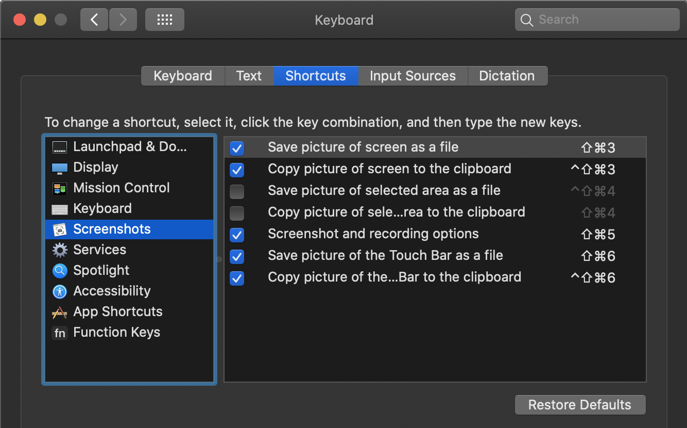
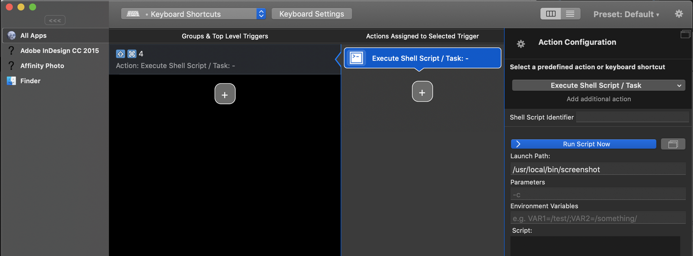

# 📋 SCREENSHOT

## Improved area screenshots for macOS: COPY to clipboard + SAVE image file

### The Issue to solve

- macOS will not allow to use the keyboard shortcut `Shift + Cmd + 4` (I personally only use area-selected screenshots) to **simultaneously** "Copy picture to clipboard" **and** "Save picture to folder"
- "Folder Actions" Service solution was attempted; however, was complicated and had a seemily inevitable **3-4 second delay** for the image file to become available in the clipboard, despite disabling "Show Floating Tumbnail" and other disables.
- Applescript and Automator solutions were attempted, but did not solve the clipboard availability delay.
- Services worked, seemingly only partially, no globally: system-wide, accross all apps, no matter which app/window was focussed.

---

### The Solution

- After investigating _MANY_ options, the following solution involves writing a simple binary (executable bash script, without the file extension) and adding a global keyboard shortcut trigger via a third-party app... I've chosen **BetterTouchTool.app** for said trigger; however there are many more (see below)

### Step 1

- Disable default macOS keyboard shortcuts for _area_ screenshots:
	- _**disable** "Save piture of selected area as a file"_
	- _**disable** "Copy picture of selected area to the clipboard"_



### Step 2

- Write bash file `screenshot` script without .sh file extension

```sh
#!/bin/bash

# ----------------------------------------------------
# MacOS ScreenCapture TWEAK !!
# Takes a screenshot to the clipboard AND saves the
# clipboard image to a file in PNG format.
# ----------------------------------------------------
# SAVE TO LOCATION: /usr/local/bin 
# make sure file is executable!
# ----------------------------------------------------

screencapture -c -i -x

destination=$HOME/Pictures/screenshots

# MacOS DEFAULT FORMAT: "Screenshot 2021-03-02 at 18.49.01.png"
# filename="Screenshot $(date +%Y-%m-%d\ at\ %H.%M.%S).png";
# filename="screenshot_$(date +%Y-%m-%d)_$(date +%H\h%M\s%S).png";

filename="screenshot_$(date +%Y%m%d)_$(date +%H.%M.%S).png";

if [ $# -ne 0 ]; then
    if [[ -d $1 ]]; then
        if [ "$1" != "." ]; then folder=$1; fi
    else
        a=$(dirname "$1")    
        b=$(basename "$1" .png)
        if [ "$b" != "" ]; then filename=$b.png; fi
        if [ "$a" != "." ]; then destination=$a; fi
    fi
fi

osascript -e "tell application \"System Events\" to ¬
        write (the clipboard as «class PNGf») to ¬
        (make new file at folder \"$destination\" ¬
        with properties {name:\"$filename\"})";
```

- optional customisations: 
	- Give the script file any semantic name you wish
	- the `screencapture -x` flag turns off the shutter sound effect
	- `destination` variable for folder location of saved image file.
	- `filename` naming convention with (or without) date and date format


### Step 3

- Make script executable: `$ chmod +x sreenshot`

### Step 4

- Assign the keyboard shortcut `Shift + Cmd + 4` (or, whatever your preference) to run the binary globally
- I am using third-party app BetterTouchTool (other options listed below) to apply the shortcut to the binary
- It appears BetterTouchTool allows pasting the contents of the script directly, instead of referencing an external file.  
- I prefer to have the script in an actual file, which i have place at path: `/usr/local/bin` which allows to skip a further step of adding to `$PATH`


### 🏁 Done

---

**Alternative applications** to assign shortcuts for running scripts:

- [Alfred](http://www.alfredapp.com/)
- [Apptivate](http://apptivateapp.com)
- [BetterTouchTool](http://boastr.de)
- [Butler](http://manytricks.com/butler/)
- [Cockpit](http://cockpitapp.com)
- [Controller Mate](http://www.orderedbytes.com/controllermate/)
- [iKey](http://plumamazing.com/mac/ikey)
- [Keyboard Maestro](http://keyboardmaestro.com/)
- [NuKit](http://www.nulana.com/nukit) (only AppleScript)
- [QuicKeys](http://startly.com/products/quickeys/mac/4)
- [Quicksilver](http://qsapp.com)
- [Shortcuts](http://nulana.com/shortcuts) (only AppleScript)
- [Spark](http://www.shadowlab.org/Software/spark.php)
- [ThisService](http://wafflesoftware.net/thisservice/)

---

*Authored by* **Justin Rankin**
[github.com/finografic](https://github.com/finografic) | [justin.blair.rankin@gmail.com](justin.blair.rankin@gmail.com)
